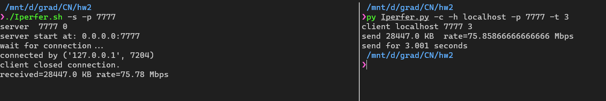
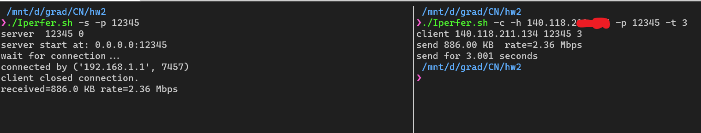
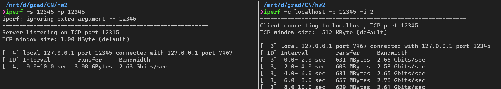
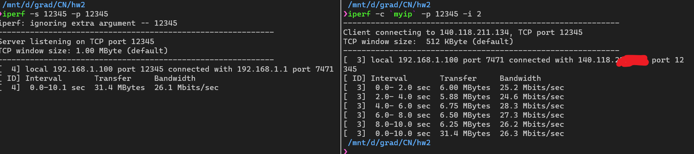

## usage
```bash
## 請在 linux 環境下執行
### using python3 ########
python3 ./Iperfer.py -s -p 7777                   # server
python3 ./Iperfer.py -c -h localhost -p 7777 -t 1 # client 

### OR using shell #######
./Iperfer.sh -s -p 7777                           # server
./Iperfer.sh -c -h localhost -p 7777 -t 1         # client 
```


### 實驗
localhost 測試


ip forwarding測試


### 與原生linux iperf 實驗比較
localhost 測試


ip forwarding測試

由實驗可以看出，使用C語言寫的原生iperf量測速率較快，可能因為python處理速度較慢導致。


### 心得

這次作業我覺得蠻有去有趣的，而且難易度適中。另外學生最好要有Linux 工具，可以直接呼叫原版iperf，了解它大概在做什麼。還要有terminal工具，可以開client,server雙視窗比較，會做的比較快。

### 這次作業我使用NAT + ip forwarding測試，
server listening在筆電的port 12345 ， client 也用筆電port瞄準12345，host設為我的router address，理論上會透過會過NAT送出wifi分享器，再送回來，在透過事先使定的ip forwarding，送到server的port 12345。
